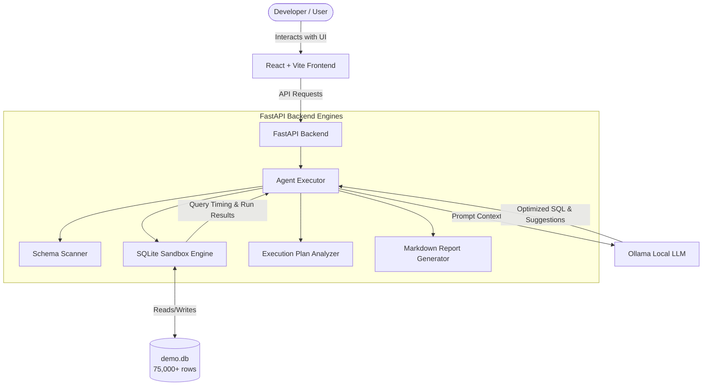

# ⚡ SQL Query Optimizer Agent

An AI-powered SQL query optimization platform that analyzes SQL queries, identifies performance bottlenecks, interprets database execution plans, suggests indexes, and automatically runs benchmarking comparisons. All AI processing runs completely locally and privately using local Large Language Models (LLMs) via **Ollama**.

Developed by **Code Hawks**

---

## 📖 Table of Contents

- [📌 Problem Statement](#-problem-statement)
- [🏗 System Architecture](#-system-architecture)
- [🚀 Key Features & Modes](#-key-features--modes)
- [📂 Project Structure](#-project-structure)
- [🛠 Technology Stack](#-technology-stack)
- [⚙️ Setup & Installation](#-setup--installation)
- [▶️ Running the Application](#-running-the-application)
- [🔌 API Reference](#-api-reference)
- [🧪 Running the Test Suite](#-running-the-test-suite)
- [📊 Demo Video & Screenshots](#-demo-video--screenshots)
- [👥 Team & Contributor Details](#-team--contributor-details)
- [📜 License](#-license)

---

## 📌 Problem Statement

Database queries written by developers are often suboptimal. This inefficiency leads to:
* **Slow execution times** causing poor user experience.
* **High database resource consumption** (CPU, memory, disk I/O).
* **High cloud infrastructure costs** as a result of overallocation.
* **Inefficient execution plans** due to missing indexes or database anti-patterns.
* **Scalability bottlenecks** as transaction volumes grow.

Manually analyzing database execution plans (`EXPLAIN QUERY PLAN`) and refactoring SQL is a specialized, time-consuming skill. The **SQL Query Optimizer Agent** solves this by automating structural query refactoring and index selection, enabling developers to tune queries inside a safe, localized sandbox before staging/production deployment.

---

## 🏗 System Architecture

The application is structured as a decoupled web application communicating via REST APIs:



### Core Execution Flow (Demo Database Mode)
1. **Validation**: The backend verifies SQL syntax validity via SQLite `EXPLAIN`.
2. **Execution Profiling**: Runs SQLite `EXPLAIN QUERY PLAN` on the query to extract the baseline plan.
3. **Context Gathering**: Reads the database schema metadata for all relevant tables.
4. **AI Analysis**: Prompts the local Ollama LLM with the schema, query, and plan to generate the optimized query and indexing strategy.
5. **Precision Benchmarking**: Executes both original and optimized queries 5 times in a sandbox environment to record precise execution times.
6. **Comparison Summary**: Computes the percentage speedup, fetches the new execution plan, and formats a final Markdown report.

---

## 🚀 Key Features & Modes

The SQL Query Optimizer Agent provides three dedicated modes tailored to different stages of query tuning:

### 1. 🟢 Demo Database Mode
* **Sandbox Execution**: Runs SQL statements directly against a pre-seeded SQLite database containing **75,000+ records**.
* **Live Benchmarking**: Measures exact execution times of both original and optimized queries over multiple runs.
* **Automated Indexing**: Generates index creation statements, applies them temporarily, and compares query performance with indexes active.
* **Execution Plan Difference**: Shows a side-by-side comparison of execution plan paths (e.g., converting a `SCAN TABLE` to an index `SEARCH TABLE`).

### 2. 🔵 Query Only Mode
* **Offline Code Analysis**: Analyzes queries statically without requiring any database connections or execution plans.
* **Anti-Pattern Detection**: Identifies common issues like `SELECT *` wildcard use, correlated subqueries, missing `WHERE` filters, and functions on indexable columns.
* **Standardized SQL Formatting**: Formats query keywords and structures dynamically.

### 3. 🔴 Query + Execution Plan Mode
* **Vendor-Agnostic Tuning**: Analyzes queries from PostgreSQL, MySQL, SQL Server, etc., by combining the query text with its pasted database query execution plan.
* **Root Cause Diagnostics**: Explains where plans are hurting performance (e.g., sorting overhead, temporary tables, materializations).
* **Estimated Performance Gain**: Uses LLM heuristic reasoning to estimate execution improvements.

---

## 📂 Project Structure

```text
SQL-Query-Optimizer-Agent/
│
├── Documents/                        # Project documentation artifacts
│   ├── project_summary.md            # Brief summary of goals and status
│   ├── architecture.md               # Detailed architectural write-up
│   ├── assumptions_limitations.md    # Key assumptions and system limits
│   ├── ai_usage_note.md              # AI-assisted development disclosure
│   └── TestCases.md                  # Manual & automated test definitions
│
├── Output_Screenshots/               # UI and benchmark screenshots
│
├── Project/
│   ├── backend/                      # Python FastAPI application
│   │   ├── tests/                    # Automated testing suite
│   │   │   └── test_agent.py         # Pytest definitions for agent/db utils
│   │   ├── agent.py                  # Orchestrates the three optimization loops
│   │   ├── db_utils.py               # SQLite execution, schemas, plans, validation
│   │   ├── demo.db                   # Local SQLite relational database (seeded)
│   │   ├── llm_utils.py              # Ollama chat integration & parsing helpers
│   │   ├── report_utils.py           # Compile downloadable markdown files
│   │   ├── sample_data.py            # Seeding script for demo.db
│   │   ├── requirements.txt          # Python package requirements
│   │   └── server.py                 # FastAPI server main entry point
│   │
│   └── frontend/                     # React web interface
│       ├── src/                      # UI components and routes
│       │   ├── components/           # Functional layout components
│       │   │   ├── OptimizerAgent.jsx # The complete optimizer workstation UI
│       │   │   ├── Hero.jsx          # Landing page hero header
│       │   │   ├── Features.jsx      # Feature grid overview
│       │   │   ├── Pipeline.jsx      # Interactive agent pipeline roadmap
│       │   │   └── Footer.jsx        # Bottom navigation footer
│       │   ├── pages/                # High level route pages
│       │   ├── App.jsx               # Application routes and main shell
│       │   └── index.css             # Main styling tailwind sheet
│       └── package.json              # Frontend node packages
│
├── Resumes/                          # Developer PDF resumes
├── Team Details/                     # Code Hawks team overview documents
├── Video/                            # Loom and MP4 demo presentations
└── README.md                         # Main repository entrypoint (this file)
```

---

## 🛠 Technology Stack

### Frontend
* **React 18**: Interactive state-based dashboard interface.
* **Vite**: Ultra-fast build tool and local dev server.
* **Tailwind CSS**: Utility-first CSS framework for clean typography and premium styling.
* **Lucide React**: Unified icon set.

### Backend
* **Python 3.8+**: Language for core processing and AI interaction.
* **FastAPI**: Modern, fast web framework for building RESTful APIs.
* **Uvicorn**: High-performance ASGI web server.

### Local Database
* **SQLite 3**: Standard relational database sandbox.
* **Seeded Dataset**:
  * `customers`: 5,000 records (with simulated location and contact data).
  * `products`: 1,000 records (price indices, category classifications).
  * `orders`: 20,000 records (total transactional receipts).
  * `order_items`: 50,000 records (order-to-product transactional links).
  * **Total Rows**: 76,000 records.

### AI Integration & Runtime
* **Ollama**: Local model deployment runtime.
* **Model Recommended**: `qwen2.5-coder:7b` (default fallback, highly optimized for SQL syntax and code restructuring) or `llama3`.

---

## ⚙️ Setup & Installation

Follow these steps to set up the backend, frontend, and local AI model on your machine:

### Prerequisites
* **Python** (version 3.8 or higher)
* **Node.js** (version 18 or higher)
* **Ollama** installed on your system (Download from [ollama.com](https://ollama.com/))

---

### Step 1: Install & Launch Ollama
1. Download Ollama for your operating system.
2. Start the local daemon:
   ```bash
   ollama serve
   ```
3. Pull the default code model (in a separate terminal window):
   ```bash
   ollama pull qwen2.5-coder:7b
   ```

---

### Step 2: Backend Setup
1. Open a terminal and navigate to the backend directory:
   ```bash
   cd Project/backend
   ```
2. Create and activate a Python virtual environment:
   ```bash
   # On Windows (PowerShell)
   python -m venv venv
   .\venv\Scripts\activate

   # On macOS/Linux
   python3 -m venv venv
   source venv/bin/activate
   ```
3. Install the required Python packages:
   ```bash
   pip install -r requirements.txt
   ```
4. Seed the demo database (`demo.db`):
   ```bash
   python sample_data.py
   ```
   *This generates 5,000 customers, 1,000 products, 20,000 orders, and 50,000 order items.*

---

### Step 3: Frontend Setup
1. Open a new terminal window and navigate to the frontend directory:
   ```bash
   cd Project/frontend
   ```
2. Install the frontend dependencies:
   ```bash
   npm install
   ```

---

## ▶️ Running the Application

Ensure Ollama is running (`ollama serve`) before starting the backend.

### 1. Launch FastAPI Backend
From the activated Python virtual environment inside `Project/backend/`:
```bash
python server.py
```
* The backend API server will run at `http://localhost:8000`.
* API documentation is available at `http://localhost:8000/docs`.

### 2. Launch React Frontend
From the `Project/frontend/` directory:
```bash
npm run dev
```
* The React client application will start at `http://localhost:5173`.
* Open `http://localhost:5173` in your browser to interact with the optimizer agent.

---

## 🔌 API Reference

### 1. Check Service Status
Check if the backend is active and if the Ollama daemon is reachable.
* **Endpoint**: `GET /api/status`
* **Response**:
  ```json
  {
    "status": "online",
    "ollama_running": true
  }
  ```

### 2. List Available Models
List all Ollama models currently pulled and ready on the local host.
* **Endpoint**: `GET /api/models`
* **Response**:
  ```json
  {
    "models": ["qwen2.5-coder:7b", "llama3:latest"],
    "default": "qwen2.5-coder:7b"
  }
  ```

### 3. Run Query Optimization
Optimizes, formats, benchmarks, and processes a query based on the selected mode.
* **Endpoint**: `POST /api/optimize`
* **Headers**: `Content-Type: application/json`
* **Request Body**:
  ```json
  {
    "mode": "demo_db",
    "sql": "SELECT * FROM orders WHERE total_amount > 45000 LIMIT 10;",
    "explain_plan": "",
    "model": "qwen2.5-coder:7b"
  }
  ```
  *(Set `mode` to `"demo_db"`, `"query_only"`, or `"explain_plan"`. Provide `"explain_plan"` string if in plan mode).*
* **Response**:
  ```json
  {
    "original_sql": "SELECT * FROM orders WHERE total_amount > 45000 LIMIT 10;",
    "steps": [
      "Validating SQL syntax...",
      "Running EXPLAIN QUERY PLAN on original query...",
      "Reading database schema...",
      "Sending to LLM for optimization analysis...",
      "Extracting optimized SQL from LLM response...",
      "Benchmarking original query...",
      "Benchmarking optimized query...",
      "Analysis complete!"
    ],
    "explain_original": "  [2] SCAN TABLE orders",
    "llm_response": "...",
    "optimized_sql": "SELECT id, customer_id, status, total_amount, created_at FROM orders WHERE total_amount > 45000 LIMIT 10;",
    "explain_optimized": "  [2] SEARCH TABLE orders USING INDEX idx_orders_amount (total_amount>?)",
    "timing_original": {
      "success": true,
      "avg_ms": 12.4205,
      "min_ms": 11.902,
      "max_ms": 13.805,
      "row_count": 10,
      "sample_rows": [...]
    },
    "timing_optimized": {
      "success": true,
      "avg_ms": 0.1425,
      "min_ms": 0.111,
      "max_ms": 0.198,
      "row_count": 10,
      "sample_rows": [...]
    },
    "improvement_pct": 98.85,
    "error": null
  }
  ```

---

## 🧪 Running the Test Suite

A complete test suite is available for verifying backend utilities, validation parsing, and LLM text extraction.

To execute the tests, ensure you are in the activated virtual environment inside the backend folder, and run:
```bash
pytest tests/ -v
```

### Coverage Areas
* **Database Utilities**: Validates schema readers, connection lifecycles, SQL explain parsers, and benchmarking timings.
* **LLM Utilities**: Verifies text extraction logic (e.g., isolating SQL query text from markdown responses).
* **Mock Execution Plans**: Simulates execution plans without making live external API requests.

---

## 📊 Demo Video 

### Loom Demo Video
Watch the system analyze real-time execution speeds and apply optimization rules in the [Loom Walkthrough Video](https://www.loom.com/share/b0e1ea716b6d42ca807894f25f98eb26).


---

